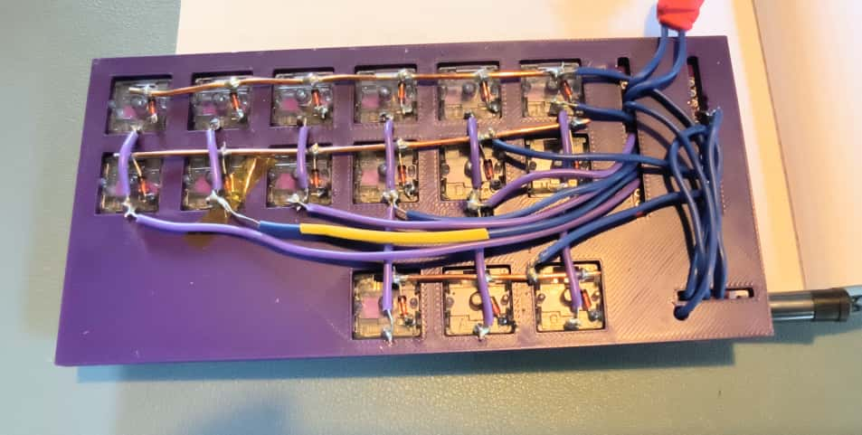
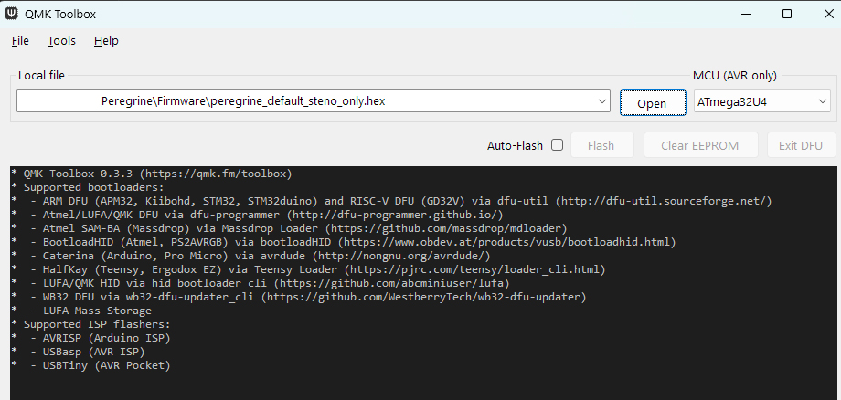

# Peregrine Split Steno Keyboard 

[](https://ko-fi.com/bioluminesceme)


A wired, split, handwired stenography keyboard with low profile Choc keys (close together to make hitting multiple keys at once easier/more comfortable)

The left half is set to master, this means the USB cable that connects the keyboard to your computer has to be connected to the left half. You can change it to MASTER_RIGHT in qmk_firmware\keyboards\peregrine\config.h and then recompile the firmware.

! Important.
Never pull the TRRS cable out when the keyboard is connected. (apparently this can short everything)


## Keymap layout

This keyboard has the default steno keyboard layout, but to make life easy I have added 2 extra keys to the left half. This way both halves are symmetrical.
The extra keys are assigned to COPY and PASTE respectively.

You can assign this to different keys in keymap.c (replace LCTL(KC_C) and LCTL(KC_V))
and then rebuild the firmware.


```txt
 ┌───┬───┬───┬───┬───┬───┐       ┌───┬───┬───┬───┬───┬───┐
 │CPY│ # │ T │ P │ H │ * │       │ * │ F │ P │ L │ T │ D │
 ├───┼───┼───┼───┼───┼───┤       ├───┼───┼───┼───┼───┼───┤
 │PST│ S │ K │ W │ R │ * │       │ * │ R │ B │ G │ S │ Z │
 └───┴───┴───┼───┼───┼───┤       ├───┼───┼───┴───┴───┴───┘
             │N1 │ A │ O │       │ E │ U │N2 │
             └───┴───┴───┘       └───┴───┴───┘

```

Small note: I couldn't get the top Steno S1 key to work, it is assigned S1, but outputs #. The bottom S one works though, use that.

This is a guide for people who have never soldered a thing before.
Expect soldering to take about a day.

## Parts List

- 30x Choc switches (I used purple ones from [aliexpress](https://www.aliexpress.com/item/1005005883472162.html?spm=a2g0o.order_list.order_list_main.100.1ed918024ECzr8) ) 25grams )
- 30x keycaps (3D printed, see in 3dmodels folder, or you can buy pretty custom ones from https://fkcaps.com/ )
- 30x 1N4148 DO-35 through-hole diodes (I got them on [aliexpress](https://www.aliexpress.com/item/4000142272546.html?spm=a2g0o.order_list.order_list_main.50.1ed918024ECzr8) in a pack of 100  )
- bare copper wire 16 AWG (1.25mm bought locally)
- solid/single core insulated wire (I got purple, 22AWG, 20meters on [aliexpress](https://www.aliexpress.com/item/1005004336218242.html?spm=a2g0o.order_list.order_list_main.20.1ed918024ECzr8) )
  - you can use both or either of these wires to solder with. The bare copper wire is easy to work with and gives some support to the switches, but you can't make any other metal touch it so I used the insulated wire for the columns.
- 2x ATMega32U4 ProMicro compatible microcontroller with USB-C connector [aliexpress](https://www.aliexpress.com/item/1005006322199481.html?spm=a2g0o.order_list.order_list_main.60.1ed918024ECzr8)
- 2x TRRS jack (3.5mm 4-pole) [per half](https://www.aliexpress.com/item/33029465106.html?spm=a2g0o.order_list.order_list_main.75.1ed918024ECzr8)   
- 2x Reset button (6x6x6 mm tactile switch, [aliexpress](https://www.aliexpress.com/item/1005006195785196.html?spm=a2g0o.order_list.order_list_main.170.1ed918024ECzr8) )
- 1x TRRS cable to connect halves [aliexpress](https://www.aliexpress.com/store/4662071?spm=a2g0o.order_list.order_list_main.177.1ed918024ECzr8) 
- 1x USB-C cable - connect this to the *left* half always, and connect that to the PC. [aliexpress](https://www.aliexpress.com/item/1005006620224278.html?spm=a2g0o.order_list.order_list_main.202.1ed918024ECzr8)
- wire stripper (to remove part of the insulation of the insulateded wire)
- wire cutter
- pliers to bend the wire into a loop for soldering


## 3D printed switch plate and case
  - switch plate: I forgot a hole for the last connection pin of the TRRS connector. Drill a small hole for that.
  - the case has some extra spacing on the side in case you want to mount the microcontroller on the bottom of the switchplate.
  - it also has some supporting pins. they were in the way of my wiring so I snipped those off.


# Start here

https://geekhack.org/index.php?topic=87689.0

Read this excellent hand soldering guide.


# What thing should be connected to which hole ?!

Microcrontroller types have different hole numbers. This is confusing and annoying.


For example as you can read below, column 3 on the left half (the column  that connects the T and K keys into a column) should be wired to P19 - Pin 19 - which on the atmega32u4 is marked A1 

## Left Half Pin Assignments  

### Column Pins  
- Column 1 (COPY, PASTE): P21   (A3)
- Column 2 (S, S): P20  (A2)
- Column 3 (T, K): P19   (A1)
- Column 4 (P, W, STN_N1): P18  (A0)
- Column 5 (H, R, A): P15   (15)
- Column 6 (*, *, O): P14   (14)

### Row Pins 
- Row 1 (Top): P7   (7)
- Row 2 (Middle): P8   (8)
- Row 3 (Bottom): P9   (9)

## Right Half Pin Assignments  

### Column Pins  
- Column 1 (*, *, E): P21 (A3)
- Column 2 (F, R, U): P20 (A2)
- Column 3 (P, B, STN_N2): P19 (A1)
- Column 4 (L, G): P18 (A0)
- Column 5 (T, S): P15 (15)
- Column 6 (D, Z): P14 (14)

### Row Pins  
- Row 1 (Top): P7 (7)
- Row 2 (Middle): P8 (8)
- Row 3 (Bottom): P9 (9)

## Diode Orientation (Column to Row)

- Diodes prevent ghosting in matrix
- **Anode** side is the positive end, this does **not** have the black band. It connects to metal pin on the **Choc switch**
- **Cathode** side is the negative end, this has the **black band**. This leg connects to the **row wire**

## Handwiring Steps

### For Each Half:

1. **Prepare switches**
   - Push the Choc switches in the switch plate, this should be a snug fit.
   
2. **Install diodes, add row wire**
   - Bend a small loop in the diode leg as per the guide I linked to. (do this in the diode leg end that does *not* have the black stripe)
   - Put the loop around the switch pin and solder it.
   - Lay the copper wire down across the row, loop all the diode legs that *do* have the black stripe around the wire with some pliers/tweezers, and solder those.
   - The rows are now soldered!
  
   

3. **Add column wires**
   - Cut the insulated wire to a bit longer than you think you need and loop the ends.
   - put the end loops around the remaining pins on the Choc switches to connect them
   - Solder the column wires

   

4. **Solder everything to the microcontroler**
   - You can and probably should flash it first, to make sure the board is not defective, before you solder it on.
   - You can also use mounting pins to make it easy to replace the board when it breaks. 
   - I did not do any of this.
   - Carefully look at what row/column wire should be connected to which pin. 
   - You can solder from any point on the row/column (from any part of the exposed wire, or from any Choc pin) to the pin/hole on the microcontroller. 
   - (ignore the yellow heat shrink tubing, I had stripped a bit too much off that wire and planned to heatshrink it to fix that, but the wire got hot enough from my soldering that the heatshrink contracted.)

   
  
5. With a multimeter, set it to the sound symbol so it will beep, and check with the probes that all your rows and columns are indeed connected to the pin on the microcontroller. Or skip this step and see if the board has any keys on 1 row or 1 column that do not work, in which case there's a connection that needs to be fixed.
It's easy to life the plate out of the case. 

6. **Add the TRRS connectors**
   - Tip=VCC, Ring1=GND, Ring2=Data (pin D0), Sleeve=GND
   - Tip is the tip of the plug, sleeve is closed to the cable.
   - Tip is inserted into the connector, so it's the 'farthest away' pin.
   - Connect Data (Ring2) to pin D0 on both halves
   - Connect VCC (Tip) to VCC on both halves
   - Connect GND (Ring1 and Sleeve) to GND on both halves
   - I found several wiring options for TRRS on different boards, so I'm not sure this actually matters too much, as long as both TRRS jacks are wired the exact same way and have GND, VCC and Data, and the Data pin D0 is set correctly in qmk_firmware\keyboards\peregrine\keyboard.json?
 
7. **Add the reset buttons**
   - The reset button is a rectangle.
   - The pins on the short side of the rectangle are GND(ground) and RST (reset)
   - Does not matter which way around.
   - The reset button is used to enter bootloader mode

```
      ┌───────────┐
 [GND]│           │[GND]
 [RST]│           │[RST]
      └───────────┘

```
 
# **Firmware**
   - if you want to use it as is, you need to download [QMK Toolbox](https://qmk.fm/toolbox), open firmware\peregrine_default_steno_only.hex in the Toolbox, connect each atmega32u4 microcontroller separately with a USB-C cable to your computer (you need to flash both). It will appear as connected and the Flash button will be enabled. I had to act fast or it would disconnect again.
   - Repeat for the other microcontroller
   - If you want to change anything (for example reassign Copy/Paste to something else, or set the other half to Master so you can plug your USB cable into that half) you need to recompile the firmware first.

   
   
## Recompile the firmware
   -  Install QMK 
   -  copy the qmk_firmware folders into your qmk root folder
   -  set user keyboard to peregrine
   -  `> qmk compile -kb peregrine -km default`
   -  firmware will compile into a new .hex file in the qmk root folder, use the toolkit to flash it onto both microcontroller boards.
  
Happy typing!


# ToDO
- Add an extra layer?
- Make a proper board in KiCAD?
- redesign the case, it's a bit creaky (I will probably just glue this thing together if the board is working, I probably want to make some tweaks after I've learned steno and make another board anyway)
- I've also added some sugru over the TRRS connectors, the edges of the microcontrolelrs, and the reset buttons so they stay put and I don't risk yanking out the part when I pull out the cable.

[](https://ko-fi.com/bioluminesceme)
