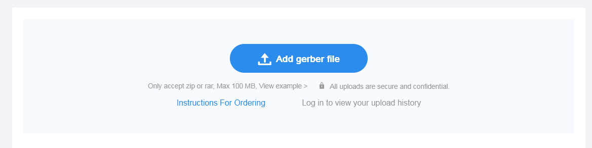
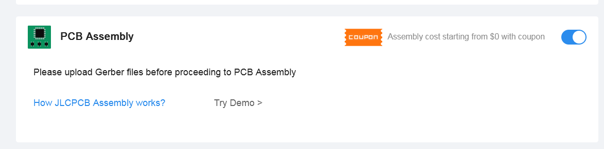
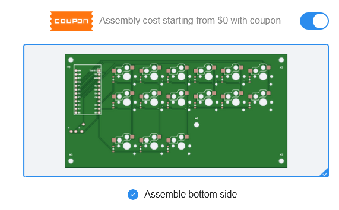
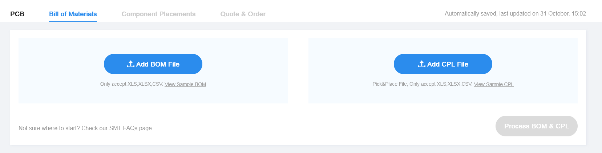
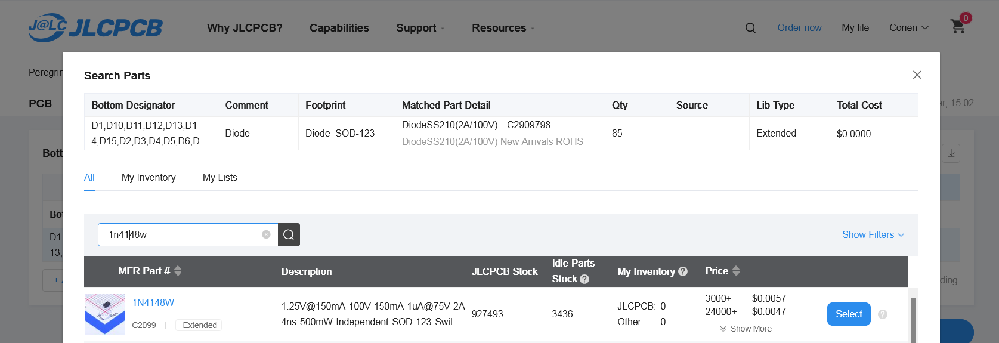

# If you want to order proper PCBs for this Peregrine keyboard.

There are 2 versions.

## Hotswap Choc with surface mount diodes

- Hotswap sockets for the Choc switches (solder on yourself)
- surface mount 1N4148W diodes. holy hell these things are small. I highly recommend you let JLCPBC solder these on (should cost about 19 dollars extra for 2x5 boards)
  

## Choc switches and through hole diodes
- standard Choc switches
- standard 1N4148 diodes with the legs and the stripe.

## Order as is
Go to JLCPCB.com (cheaper). Click Instant Quote, then click the upload Gerbers file and select the zip file in 
(peregrine - your choice - left / right / production)

For example for the left board of the surface mount, you'd upload 
kicad\peregrine-surfacemount-left\production\PeregrineKicadLeftSMDFinal.zip

Pick the board color you want.

Enable PCB assembly 

And select "Assemble bottom side"

then click the big blue Next button in the right sidebar under the price.

Click next and it will ask you to upload the BOM and CPL file

Upload bom.csv to BOM, and positions.csv to CPL

It will then likely complain about a shortfall (lack of stock) for the diodes.
Click the magnifying glass to search for a replacement part, 
type in 

1n4148w in the field (for surface mount diodes)

And then get your quote and shipping etc.

# Change board layout

If you want to make changes to the spacing/components on the board.
Open KiCad 8.0 (9.0 has some compatibility problems)

File - open Project.
Navigate to one of the folders, for example kicad\peregrine-surfacemount-left
And it will let you open the project file.

Watch all of https://youtu.be/8WXpGTIbxlQ for an excellent walk through
and open the schematic file, and the corresponding board file

